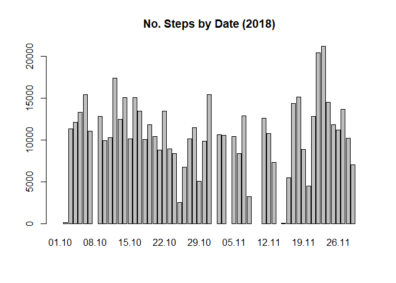
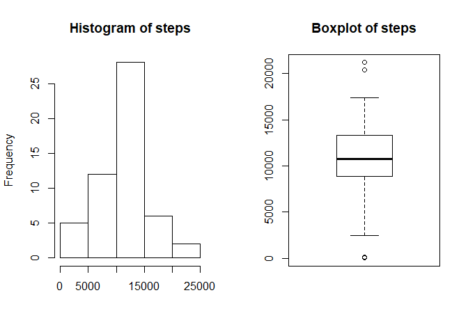
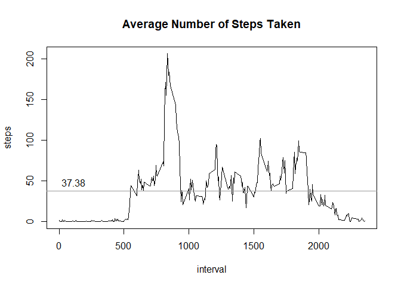
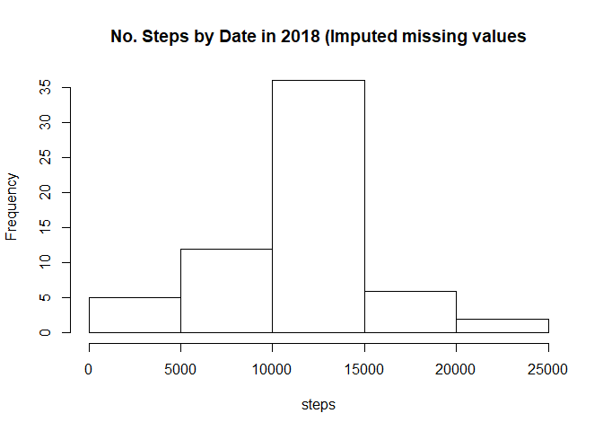
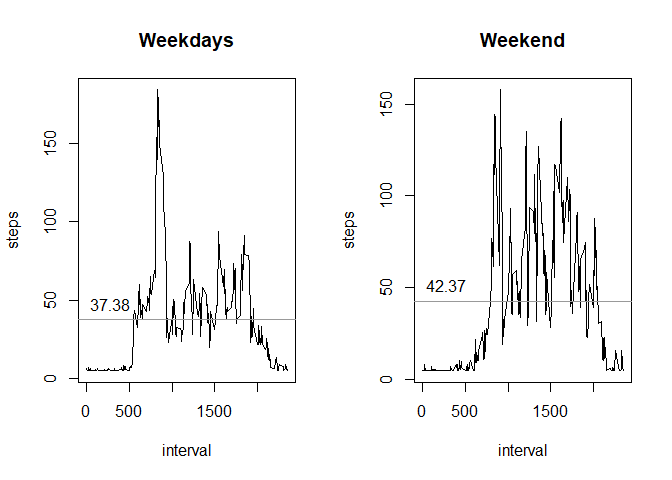

### Prepare Local Environment

    Sys.setlocale("LC_MESSAGES", 'en_GB.UTF-8')
    Sys.setenv(LANG = "en_US.UTF-8")

    #setwd("C:/Users/tomas/OneDrive/Dokumenty/R/Coursera/ReproducibleResearch/Assignment1")

    if (!dir.exists("LandingZone")){
      dir.create("LandingZone")
      print("Folder LandingZone created!")
    } else {
      print("Folder LandingZone already exists!")
    }

    if (!dir.exists("Data")){
      dir.create("Data")
      print("Folder Data created!")
    } else {
      print("Folder Data already exists!")
    }

    download.file( url = "https://d396qusza40orc.cloudfront.net/repdata%2Fdata%2Factivity.zip",  
                   destfile = "LandingZone/ActivityMonitoringData.zip", 
                   method = "libcurl" )

    unzip( zipfile = "LandingZone/ActivityMonitoringData.zip", exdir = "Data" )

### 1. Code for reading in the dataset and/or processing the data

    d0 <- read.csv("Data/activity.csv", header = TRUE, sep = ",", na.strings= "NA", 
             colClasses = c("numeric", "character", "numeric"))

    d0$date     <- as.POSIXct( strptime(d0$date, "%Y-%m-%d" ))

### 2. Histogram of the total number of steps taken each day

#### Total number of steps per day

    #install.packages("dplyr")
    library("dplyr")

    a1 <- d0 %>% 
      group_by(date) %>%
      summarise(steps = sum(steps))
     
    with(a1, barplot(steps, names.arg = format(a1$date, format="%d.%m"), main = "No. Steps by Date (2018)"))

#### Histogram and Boxplot

    par(mfrow = c(1,2))
    with(a1, hist(x = steps, xlab = ""))
    with(a1, boxplot(x = steps, main = "Boxplot of steps"))

### 3. Mean and median number of steps taken each day

    mean(a1$steps, na.rm = TRUE)

    ## [1] 10766.19

    median(a1$steps, na.rm = TRUE)

    ## [1] 10765

### 4. Time series plot of the average number of steps taken

    a2 <- d0 %>% 
      group_by(interval) %>%
      summarise(steps = mean(steps, na.rm = TRUE))

    mean_a2_steps <- mean(a2$steps)

    with(a2, plot(interval, steps, type = "l", main = "Average Number of Steps Taken"))
    abline(h = mean_a2_steps, col = "gray60")
    text(x = 0, y = mean_a2_steps+5, format(round(mean_a2_steps, 2), nsmall = 2), col = 1, adj = c(-.1, -.1))

### 5. The 5-minute interval that, on average, contains the maximum number of steps

    subset(a2, steps == max(steps))

    ## # A tibble: 1 x 2
    ##   interval steps
    ##      <dbl> <dbl>
    ## 1      835  206.

### 6. Code to describe and show a strategy for imputing missing data

#### Investigate Null values

    # 1. Calculate and report the total number of missing values in the dataset (i.e. the total number of rows with NAs)

    summary(d0)

    ##      steps             date                        interval     
    ##  Min.   :  0.00   Min.   :2012-10-01 00:00:00   Min.   :   0.0  
    ##  1st Qu.:  0.00   1st Qu.:2012-10-16 00:00:00   1st Qu.: 588.8  
    ##  Median :  0.00   Median :2012-10-31 00:00:00   Median :1177.5  
    ##  Mean   : 37.38   Mean   :2012-10-30 23:32:27   Mean   :1177.5  
    ##  3rd Qu.: 12.00   3rd Qu.:2012-11-15 00:00:00   3rd Qu.:1766.2  
    ##  Max.   :806.00   Max.   :2012-11-30 00:00:00   Max.   :2355.0  
    ##  NA's   :2304

    x1 <- table(is.na(d0))
    x2 <- matrix(x1, nrow = 1, ncol = 2, dimnames = list(c("no. occurencies"),c("Non NULL","NULL")))

    # number of NULL occurencies
    x2

    ##                 Non NULL NULL
    ## no. occurencies    50400 2304

    # Percentage of NULL occurencies:
    x3 <- x2[,2]/x2[,1]

There are 2304 NULL occurencies representing 4.6% of the total number of
rows

#### Calculate mean of a day and a mean for the whole dataset if the day doesnt contain any data.

    # Calcualte mean of steps for each day
    imputed_date_d0 <- d0 %>% 
      group_by(date) %>%
      summarise(steps = mean(steps, na.rm = TRUE))

    # For dates with missing data impute them with a mean of steps from all dates
    imputed_date_d0 <- imputed_date_d0
    imputed_date_d0$steps[is.na(imputed_date_d0$steps) == TRUE] <- mean(d0$steps, na.rm = TRUE)

#### Impute missing values in the original dataset

    # Use those values to impute missing values in the base dataset
    imputed_d0 <- d0

    imputed_d0 <- left_join(d0, imputed_date_d0, by = "date")

    imputed_d1 <- rename(imputed_d0, 
           steps_src = steps.x,
           steps_imp = steps.y )

    imputed_d1$steps <- coalesce(imputed_d1$steps_src,imputed_d1$steps_imp )

    imputed_data <- select(imputed_d1, 
                         date,
                         interval,
                         steps_src,
                         steps_imp,
                         steps)

### 7. Histogram of the total number of steps taken each day after missing values are imputed

    e1 <- imputed_data %>% 
      group_by(date) %>%
      summarise(steps = sum(steps))
     
    with(e1, hist(steps, main = "No. Steps by Date in 2018 (Imputed missing values"))

### 8. Panel plot comparing the average number of steps taken per 5-minute interval across weekdays and weekends

    imputed_data$weekday <- weekdays(imputed_data$date)

    weekdays_dataset <- subset(imputed_data, weekday != "Saturday" | weekday != "Sunday" )
    weekend_dataset <- subset(imputed_data, weekday == "Saturday" | weekday == "Sunday" )

    weekdays_d1 <- weekdays_dataset %>% 
      group_by(interval) %>%
      summarise(steps = mean(steps, na.rm = TRUE))

    weekend_d1 <- weekend_dataset %>% 
      group_by(interval) %>%
      summarise(steps = mean(steps, na.rm = TRUE))

    mean_weekdays_d1 <- mean(weekdays_d1$steps)
    mean_weekend_d1 <- mean(weekend_d1$steps)

    par(mfrow = c(1,2))

    with(weekdays_d1, plot(interval, steps, type = "l", main = "Weekdays"))
    abline(h = mean_weekdays_d1, col = "gray60")
    text(x = 0, y = mean_weekdays_d1+5, format(round(mean_weekdays_d1, 2), nsmall = 2), col = 1, adj = c(-.1, -.1))

    with(weekend_d1, plot(interval, steps, type = "l", main = "Weekend"))
    abline(h = mean_weekend_d1, col = "gray60")
    text(x = 0, y = mean_weekend_d1+5, format(round(mean_weekend_d1, 2), nsmall = 2), col = 1, adj = c(-.1, -.1))

